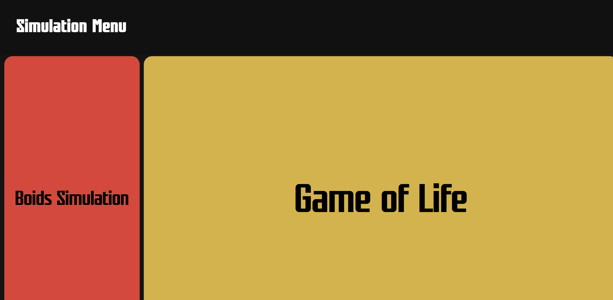

# Boids and Game of Life Simulation
## Overview
The main goal is to create a collection of two interactive simulations, which demonstrate emergent behaviour - these simulations are to be accessed from a main page:

1. Boids Simulation - Models flocking behaviour of autonomous agents using alignment, cohesion, and separation rules.
2. Game of Life - Implements Conway’s cellular automaton to showcase patterns evolving from simple rules.
- These simulations are to be accessed via a main page

## Final Showcase
### Main Page
  

### Main Page - hovering over either the Boids or Game of Life option
 
  

### Boids Simulation Page
  

### Game of Life Simulation Page
  

### Game of Life Simulation Page - Draw Mode
  

### Game of Life Simulation Page - Pressing Play during Draw Mode
  
